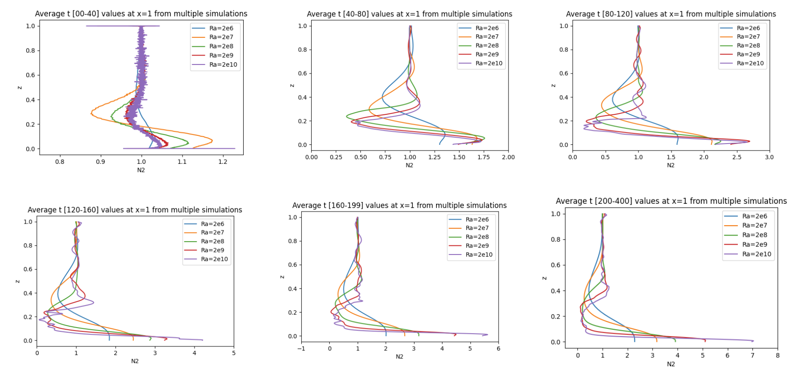

# convective_adjustment
**Motivation:** The Rayleigh-Benard convection system is often used to study the atmosphere, if we change the system, what are the implications of the result for real world applications?

**Project Overview:**
* We take 2D horizontally-periodic Rayleigh-Benard convection and change the boundary conditions.
* Our new system is stably stratified, we have cold on the bottom and heat on the top, this creates a heat pocket, a plume, that shoots vertically up.
* As we increase the Rayleigh number, the plume loses it’s coherent structure. 
* We look at the height vs buoyancy frequency to study this more.

**Main question:** how can the plume influence the atmosphere very far away from itself?

**Method:** what will it take to make this system crash and how do we numerically solve that?

**Computational aspects:** created simulations with the Dedalus pseudospectral framework and this required the university supercomputer.

**Numerical Analysis:** experimented on how much I could increase the Rayleigh number and look out for Gibbs phenomenon
* the resolution parameters 
* number of nodes used 
* CFL parameters (i.e. time step)

**Simulation Output:**
[Watch the simulation video on Google Drive](https://drive.google.com/file/d/1zAbdlgiqk8T3GQ-I4Y2yTTrIPN0r6_iT/view?resourcekey)

**Results at x=1:**
 

**Fig.1:** The z-axis (vertical axis) represents the height in the domain, normalized to 1. The x-axis (horizontal axis) represents the buoyancy frequency squared (N2). Color-coded lines indicate the Rayleigh number, illustrating the impact of increasing Ra on the buoyancy profiles over time. This is a time averaged study from multiple simulations at a fixed position x=1. We note the large mixing disturbance for higher Ra.
